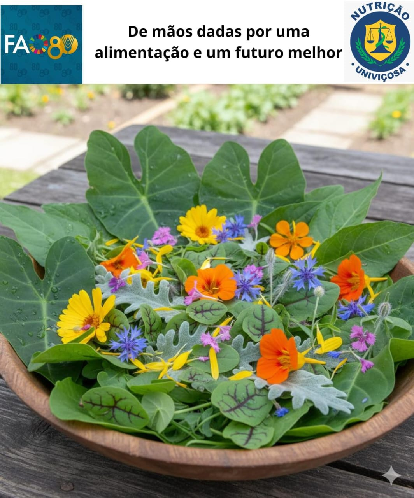
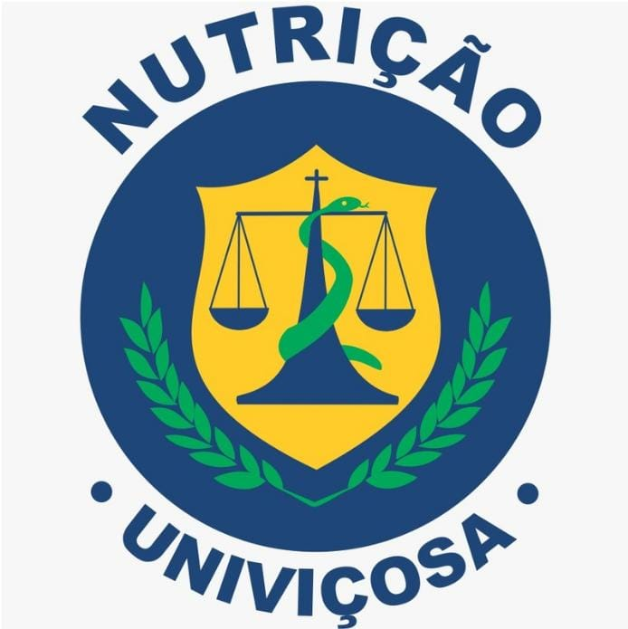

<h1>Livro de Receita PANC</h1>

## De mãos dadas por uma alimentação e um futuro melhor

Elaborado pelas alunas: Gabrielle Oliveira | Milena Heleno | Vitória Costa

Professora: Luiza Veloso Dutra

NUT338 - Educação Alimentar e Nutricional