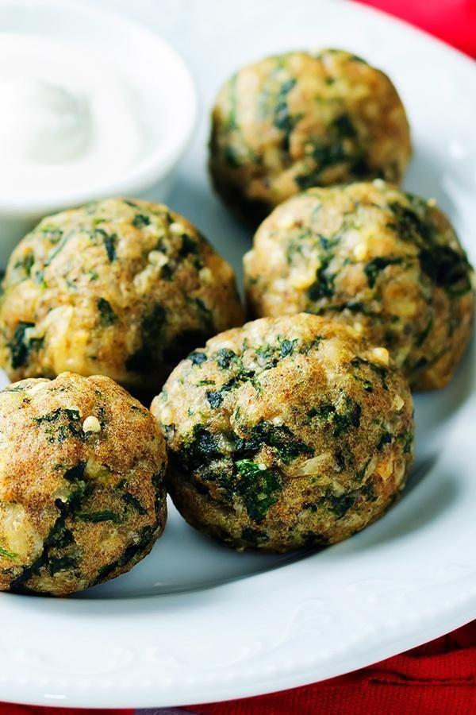

# BOLINHO DE FUBÁ COM LOBROBRO (ORO-PRO-NOBIS)

## Ingredientes:

- 1 Ovo
- Salsa
- Cebolinha
- Cebola ralada
- Pedaços picados de oro-pro-nobis
- Sal a gosto
- Alho
- 1 Xícara de fubá
- Meia xícara de leite
- 1 Colher de fermento químico

## Modo de preparo:

Misture tudo garantindo o ponto de enrolar com as mão e frite em óleo quente

## Citado por:

Ana Araceli, nascida em Viçosa - MG, receita ensinada pela sua mãe, e conhecida desde sua infância
