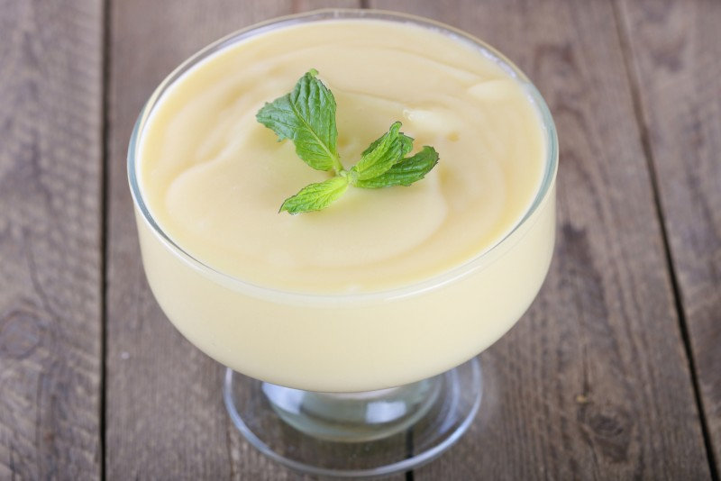

# MOUSSE DE BUTIÁ

## Ingredientes:

- 1 copo e meio de polpa de butiá (400ml)
- 1 lata de leite condensado
- 1 lata de creme de leite
- 1 envelope de gelatina incolor

## Modo de preparo:

Bater tudo no liquidificador e gelar.

## Citado por:

André Luiz. Preparação descoberta em um livro de receitas e replicada em casa.
