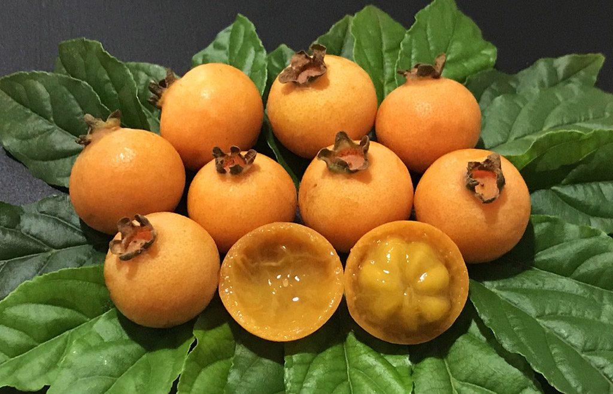

# MOUSSE DE GABIROBA

## Ingredientes

- 1 1/2 medida de polpa de gabiroba
- 1 Medida de nata
- 1 Medida de leite condensado

## Modo de preparo:

Misture tudo e gele.

Para fazer sorvete: bater e congelar, bater e congelar por 3 vezes.

## Citado por:

André Luiz, nascido em Viçosa - MG preparação descoberta em um livro de receitas e replicada em casa.
