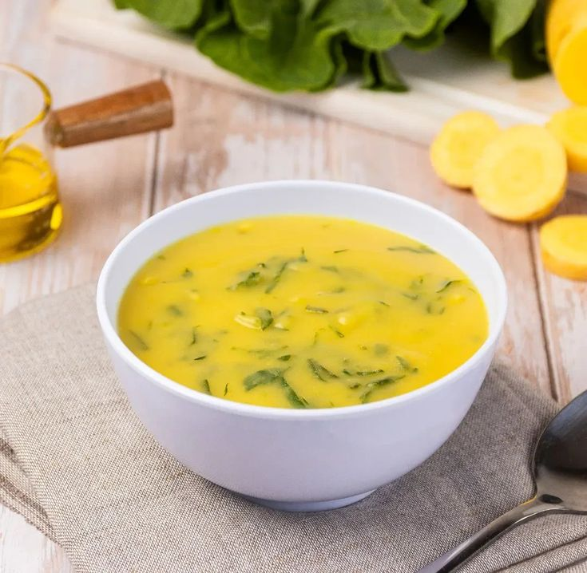

# SOPA DE FUBÁ COM SERRALHA

## Ingredientes:

- 1 Xícara fubá
- 4 Xícaras água
- Serralha picada
- A gosto sal e pimenta
- 1/2 Cebola

## Modo de preparo:

Dilua o fubá em 1 xícara de água fria e reserve; frite a cebola

Acrescente o fubá já diluído na água junto da cebola, acrescente aos poucos o restante da água até engrossar; tempere

refogue a serralha e acrescente ao fubá

## Citado por:

Romilda, nascida em Viçosa - MG, por ter serralha em seu quintal, faz com frequência este mingau em noites frias.
