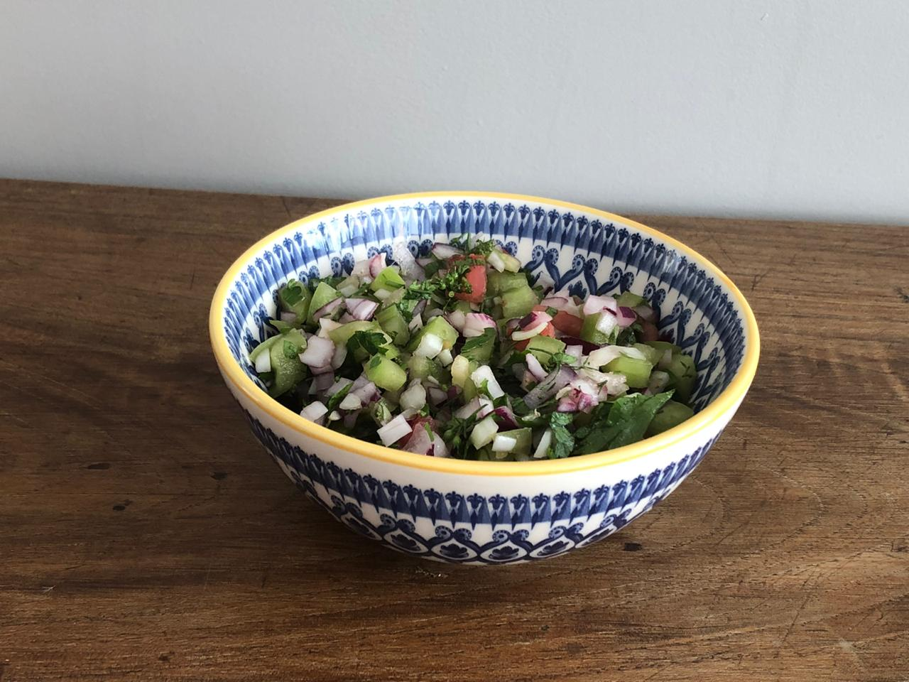

# VINAGRETE DE TOMATE VERDE COM MARIA GODO

## Ingredientes:

- 2 Tomates verdes
- 1 Cebola
- Limão
- 50ml Vinagre de arroz
- 60ml de azeite
- Sal a gosto
- Pimenta do reino a gosto
- Meio maço de Maria godo

## Modo de preparo:

Retire a sementes do tomate e pique em cubos do tamanho de sua preferência, reserve-os

Repique a cebola a Maria godo e misture com os tomates

Adicione o suco do limão o azeite e o vinagre

Adicione o sal e a pimenta no seu gosto

O ideia e deixar descansar por 30 min antes de servir para os ingredientes emuncionar

E um ótimo acompanhamento para carnes de porco bolinhos e no churrasco.

## Citado por:

André Luiz, nascido em Viçosa - MG, gastrônomo chef, oferecia esta receita no cardápio de seu restaurante.
